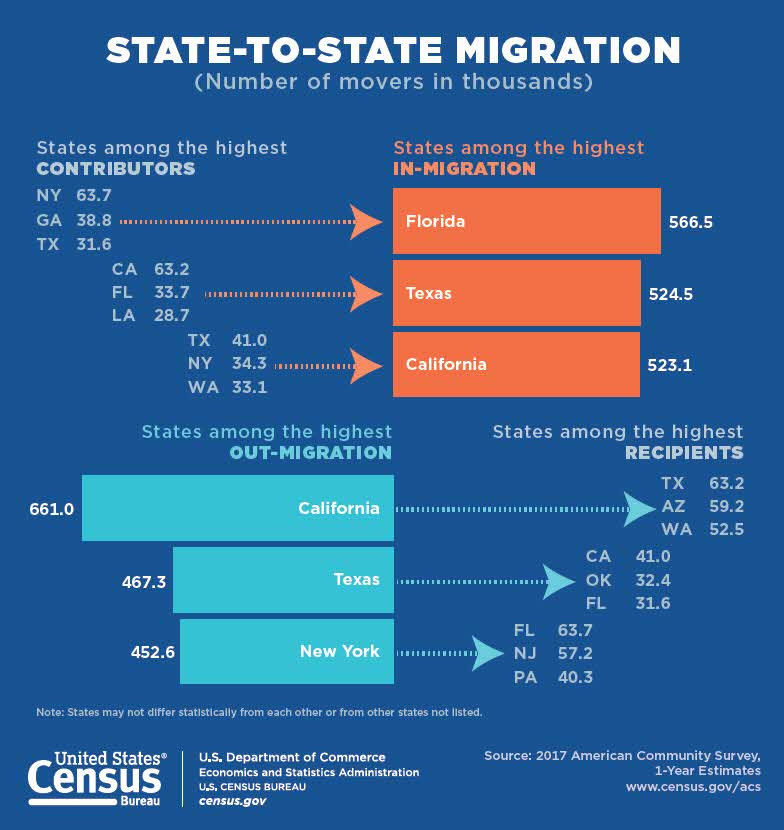

Security Analysis Shiny project presentation
========================================================
author: Amit Behura
date: 29th June, 2020
autosize: true
font-family: 'Helvetica'

Overview
========================================================
This project uses USArrest dataset from build-in datasets provided by R. with 50 observations and 4 variables.

```r
str(USArrests)
```

```
'data.frame':	50 obs. of  4 variables:
 $ Murder  : num  13.2 10 8.1 8.8 9 7.9 3.3 5.9 15.4 17.4 ...
 $ Assault : int  236 263 294 190 276 204 110 238 335 211 ...
 $ UrbanPop: int  58 48 80 50 91 78 77 72 80 60 ...
 $ Rape    : num  21.2 44.5 31 19.5 40.6 38.7 11.1 15.8 31.9 25.8 ...
```


Shiny App
========================================================
- The Shiny App created here, has a sidebarpanel and a main panel. 
- It uses a slider input to take the value of new UrbanPop or Urban Population percentage of a location.
- predicted Values of other 3 variables (those are Murder rate, Assault Rate, Rape rate) will be the output in main panel.
- Main panel contains 3 tabs corresponding to different linear regression model used for prediction. 
- If the predicted value is in the upper side of the horizontal cutoff, the location refer to be less secure across USA.


  
  
Usability
========================================================

According to <www.census.gov> nearly 10 percent of people in USA move from state to state per year. this app can be used to calculate Riskfactor of moving to new location.



Conclusion
========================================================
- This project is for the completion of JHU Coursera Data Product course.
- The shiny App have used minimal methods to create to model. you can reach out to be at: <um19139@stu.ximb.ac.in> (Amit Behura).
- Shiny is published on ShinyApps server. go to following URL:<https://maxspyder.shinyapps.io/security_analysis/>
- ui.R and server.R for this project is published in github. go to following URL: 
 <https://github.com/maxspyder/Data_Products>


